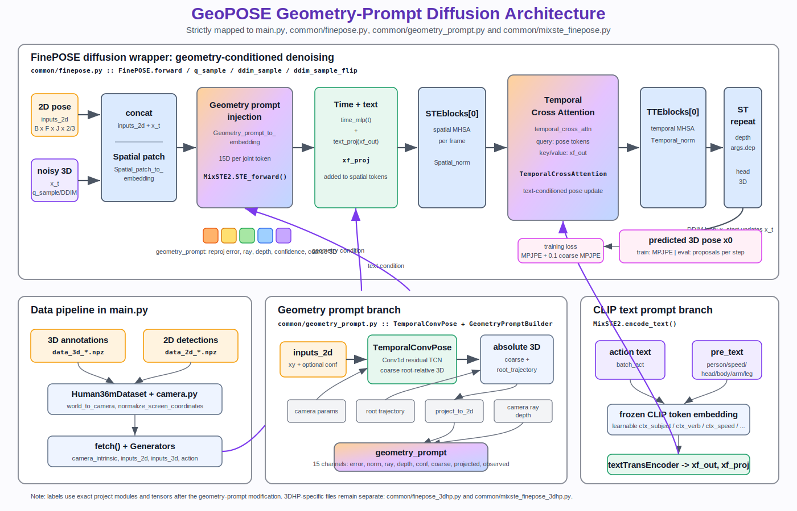
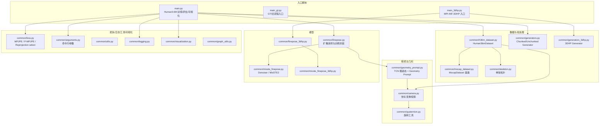
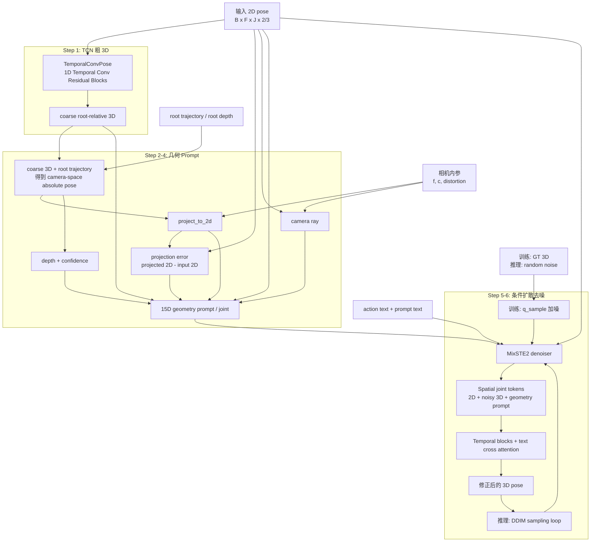
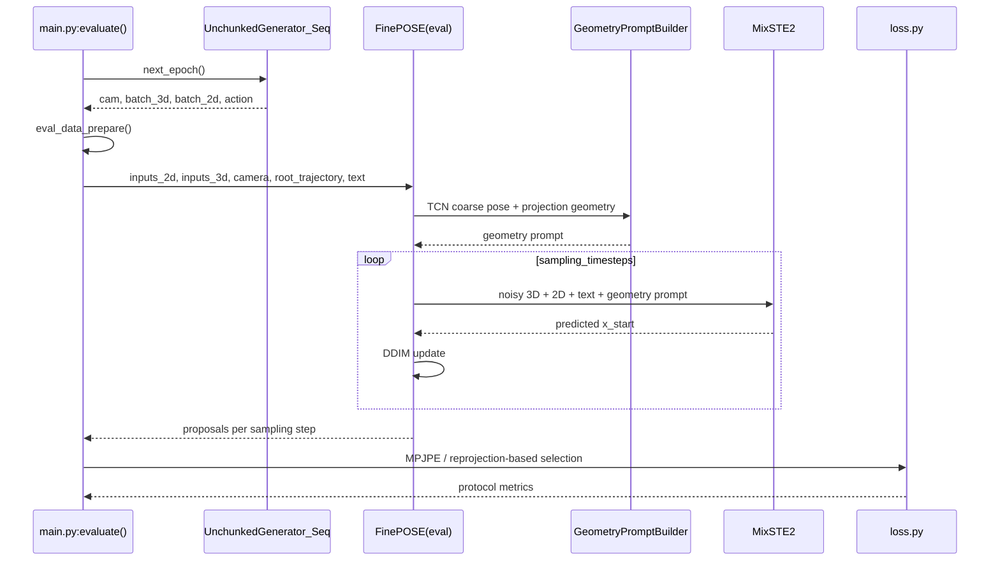

# GeoPOSE Project Architecture

本文档用 Mermaid 描述当前项目的代码结构、训练/推理数据流，以及加入 geometry prompt 后的 FinePOSE 模型内部流程。

## 1. 模块总览

## 2. 训练数据流

```mermaid
flowchart LR
    Args["parse_args()"] --> Load3D["加载 data_3d_<dataset>.npz"]
    Load2D["加载 data_2d_<dataset>_<keypoints>.npz"] --> Normalize2D["normalize_screen_coordinates"]
    Load3D --> CameraSpace["world_to_camera<br/>得到 camera-space 3D"]
    CameraSpace --> RootSplit["保存 root trajectory<br/>训练目标 root-relative"]
    Normalize2D --> Fetch["fetch(subjects_train/test)"]
    RootSplit --> Fetch
    Fetch --> Generator["ChunkedGenerator_Seq<br/>按 number_of_frames 切片"]
    Generator --> Batch["batch_2d, batch_3d, camera_intrinsic, action"]
    Batch --> Text["CLIP tokenize action/pre_text"]
    Batch --> FinePOSETrain["FinePOSE.forward(train)"]
    Text --> FinePOSETrain
    FinePOSETrain --> Pred3D["denoised 3D pose"]
    FinePOSETrain --> Coarse3D["TCN coarse 3D pose"]
    Pred3D --> Loss3D["MPJPE(final, GT)"]
    Coarse3D --> CoarseLoss["MPJPE(coarse, GT)"]
    Loss3D --> Total["total loss"]
    CoarseLoss --> Total
    Total --> Optim["AdamW 更新"]
```

## 3. FinePOSE + Geometry Prompt 内部结构

## 4. 推理与评估流程

## 5. 关键张量约定

| 数据 | 形状 | 含义 |
| --- | --- | --- |
| `inputs_2d` | `B x F x J x 2/3` | 归一化 2D 关节，第三通道可作为置信度 |
| `inputs_3d` | `B x F x J x 3` | root-relative 3D 训练目标 |
| `inputs_traj` | `B x F x 1 x 3` | root 轨迹，用于恢复 camera-space absolute pose |
| `camera_params` | `B x 9` | Human3.6M 内参向量 |
| `coarse_pose` | `B x F x J x 3` | TCN 输出的粗 3D pose |
| `geometry_prompt` | `B x F x J x 15` | 投影误差、相机射线、深度、置信度等几何条件 |
| `predicted_3d_pos` | 训练: `B x F x J x 3`；推理: `B x T x H x F x J x 3` | 扩散 denoiser 输出 |
